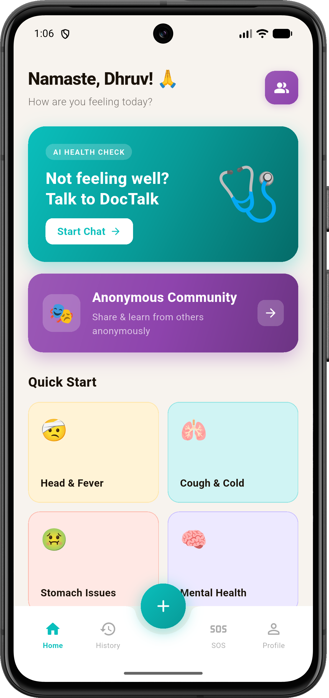
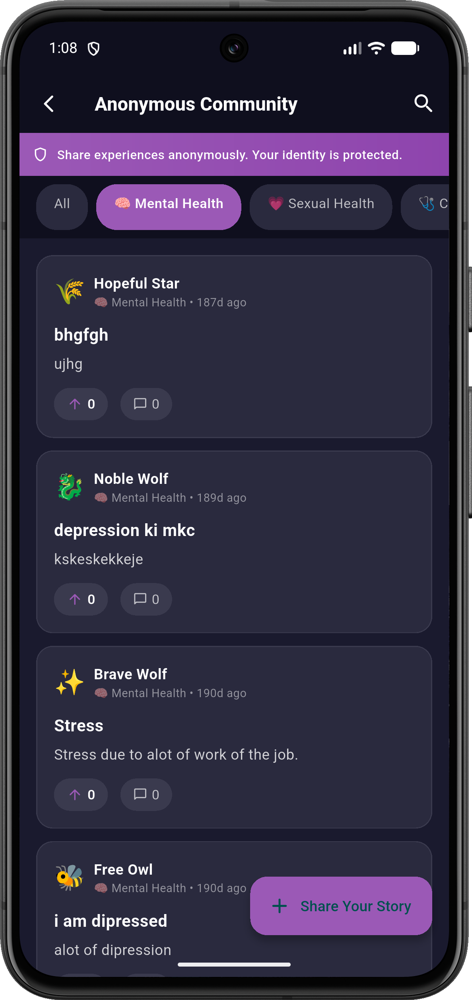
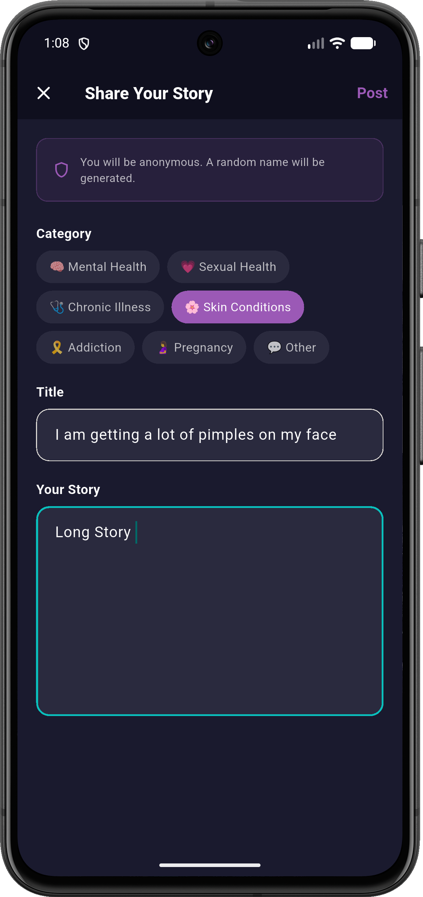
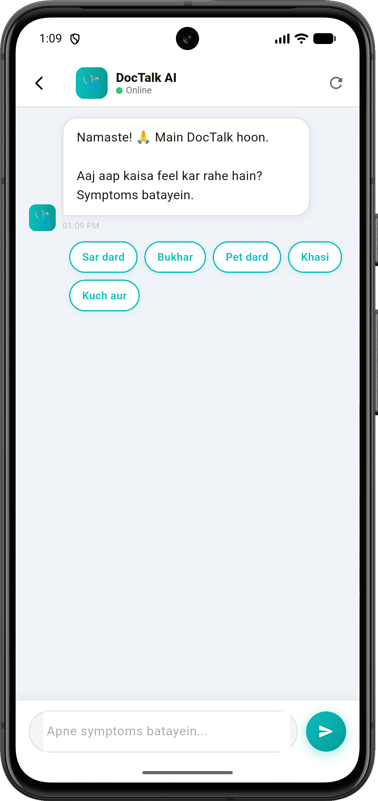
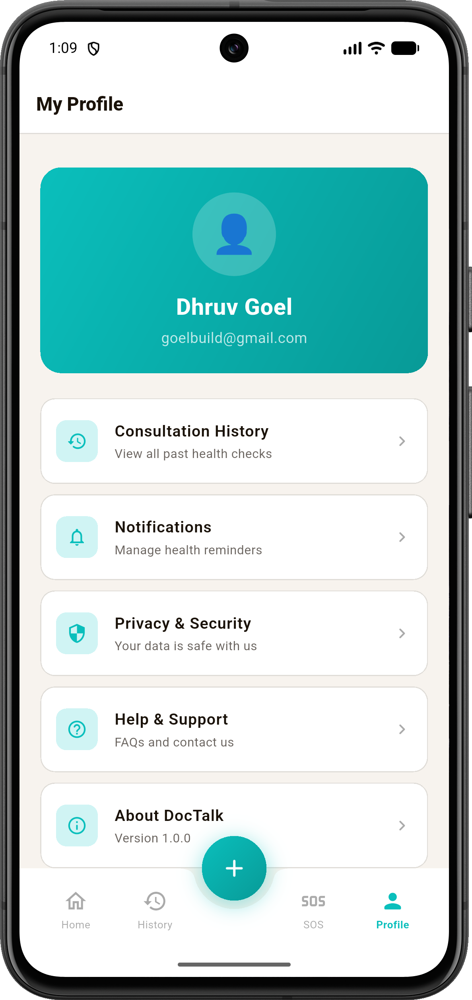

# 🩺 DocTalk — Your AI Health Companion & Telemedicine Platform

<div align="center">

[](https://flutter.dev)
[](https://dart.dev)
[](https://firebase.google.com)
[](https://ai.google.dev/)
[](https://pub.dev/packages/get)
[](LICENSE)

<p align="center">
  <strong>DocTalk</strong> is an intelligent, privacy-first healthcare and telemedicine mobile application built with Flutter. Powered by <strong>Google Gemini 1.5 Flash</strong>, it provides instant AI health assessments, a certified <strong>Doctor Discovery & Appointment Booking System</strong>, an <strong>Anonymous Peer-Support Community</strong>, and comprehensive <strong>Health Records</strong>.
</p>

</div>

---

## 📱 App Screenshots

<div align="center">

<table>
  <tr>
    <td align="center" width="33%">
      
      <br />
      <strong>🏠 Home Dashboard</strong>
      <br />
      <em>Greeting, AI Health Check CTA, Quick Symptom Chips & Doctor Discovery</em>
    </td>
    <td align="center" width="33%">
      
      <br />
      <strong>🩺 AI Consultation Chat</strong>
      <br />
      <em>Empathetic diagnosis & multi-turn triage with Gemini 1.5 Flash</em>
    </td>
    <td align="center" width="33%">
      
      <br />
      <strong>📋 Clinical Health Assessment</strong>
      <br />
      <em>Likely conditions, risk severity, specialist advice & home care tips</em>
    </td>
  </tr>
  <tr>
    <td align="center" width="33%">
      
      <br />
      <strong>👨‍⚕️ Doctor Finder & Clinics</strong>
      <br />
      <em>Discover certified specialists, view ratings, fees & available slots</em>
    </td>
    <td align="center" width="33%">
      
      <br />
      <strong>📑 Health Records & History</strong>
      <br />
      <em>Consultation transcripts, assessment logs & booked appointments</em>
    </td>
    <td align="center" width="33%">
      
      <br />
      <strong>🎭 Community & Care</strong>
      <br />
      <em>Anonymous health forum, peer support & holistic wellness</em>
    </td>
  </tr>
</table>

</div>

---

## 📌 Table of Contents

- [Overview](#-overview)
- [App Screenshots](#-app-screenshots)
- [Key Features](#-key-features)
  - [1. 🤖 AI Symptom Checker & Clinical Assessment](#1--ai-symptom-checker--clinical-assessment)
  - [2. 👨‍⚕️ Doctor Discovery & Slot Booking](#2-️-doctor-discovery--slot-booking)
  - [3. 🎭 Anonymous Peer-Support Community](#3--anonymous-peer-support-community)
  - [4. 📋 Health Records & Consultation History](#4--health-records--consultation-history)
  - [5. 🔐 Secure Authentication & User Profile](#5--secure-authentication--user-profile)
- [App Architecture](#-app-architecture)
- [Folder Structure](#-folder-structure)
- [Tech Stack & Libraries](#-tech-stack--libraries)
- [Getting Started](#-getting-started)
  - [Prerequisites](#prerequisites)
  - [Installation & Setup](#installation--setup)
  - [Environment Configuration](#environment-configuration)
  - [Firebase Setup](#firebase-setup)
- [Running the App](#-running-the-app)
- [Quality & Verification](#-quality--verification)
- [Medical Disclaimer](#-medical-disclaimer)
- [License](#-license)

---

## 🌟 Overview

> *"Doctors give you a diagnosis. DocTalk gives you a Saathi."*

**DocTalk** bridges the gap between initial health questions and professional clinical care. By combining **Google Gemini 1.5 Flash** generative AI with local geolocation doctor discovery and telemedicine appointment booking, DocTalk provides users with:
1. Instant, empathetic health triage and structured clinical insights.
2. Verified local doctor recommendations and seamless slot booking.
3. A safe, anonymous space to discuss sensitive health concerns with peers.
4. Centralized health records tracking past consultations and upcoming appointments.

---

## ✨ Key Features

### 1. 🤖 AI Symptom Checker & Clinical Assessment
- **Empathetic Conversational AI**: Multilingual triage supporting English, Hindi, and Hinglish.
- **Structured Assessment Cards**: Returns structured clinical evaluations with:
  - **Likely Medical Conditions**: Primary hypothesis and secondary differentials.
  - **Severity Calculation**: `LOW` (home care), `MEDIUM` (visit doctor soon), or `URGENT` (immediate medical attention).
  - **Specialist Recommendations**: Tailored doctor suggestions (e.g., General Physician, Cardiologist, ENT, Dermatologist, Orthopedic).
  - **Home Care Remedies**: Practical immediate relief and wellness advice.
  - **Red-Flag Warnings**: Crucial warning symptoms that mandate immediate emergency care.
- **Dynamic Quick Reply Chips**: Tap pre-suggested answer buttons for fast, convenient responses.
- **Voice Input**: Integrated Speech-to-Text for hands-free symptom descriptions.

### 2. 👨‍⚕️ Doctor Discovery & Slot Booking
- **Location-Based Search**: Real-time GPS coordinate lookup to find nearby clinics and practitioners.
- **Practitioner Profiles**: View qualifications, ratings, patient reviews, years of experience, clinic addresses, and consultation charges.
- **Slot Selection & Booking**: Choose preferred appointment dates and times with instant confirmation stored locally and in Cloud Firestore.
- **Google Maps Integration**: One-tap directions and navigation to clinics.

### 3. 🎭 Anonymous Peer-Support Community
- **Safe & Anonymous**: Discuss health issues and recovery stories without exposing your identity.
- **Randomized Personas**: Automatic generation of anonymous avatars and unique pseudonyms.
- **Categorized Health Topics**: Filter posts by Mental Health, Chronic Illness, Lifestyle, Parenting, and Recovery.
- **Interactive Discussions**: Create posts, share experiences, comment, and upvote helpful advice.

### 4. 📋 Health Records & Consultation History
- **Consultation Transcripts**: Revisit previous AI symptom checker conversations and full assessment reports.
- **Appointment Tracker**: View active, upcoming, and past doctor appointments with one-tap status management.
- **Offline First**: Fast access powered by local persistence and synced with Firebase.

### 5. 🔐 Secure Authentication & User Profile
- **Firebase Authentication**: Email and password authentication with encrypted session tokens.
- **Profile Customization**: Manage personal information, notifications, and security preferences.

---

## 🏗️ App Architecture

DocTalk uses the **GetX** architectural pattern for reactive state management, dependency injection, and centralized routing:

```
lib/
├── bindings/       # Dependency injection bindings (AppBindings, ChatBindings)
├── controllers/    # GetX state controllers (Auth, Chat, Booking, DoctorFinder, Community, Nav)
├── models/         # Immutable data models & Firestore serialization
├── resources/      # Routes, pages, themes, color tokens, and constants
├── screens/        # Modular UI screen implementations
│   ├── AnonymousChat/       # Community forum, post details & creation
│   ├── AppointmentBooking/  # Doctor details, slot booking & confirmations
│   ├── Auth/                # Splash, login, and signup screens
│   ├── HomeScreen.dart      # Main dashboard with animated bottom bar
│   ├── chat_screen.dart     # AI consultation interface
│   ├── doctor_finder_screen.dart # Doctor exploration & filter view
│   ├── history_screen.dart  # Consultation logs & appointment tracker
│   └── profile_screen.dart  # User profile & settings
├── services/       # External APIs (Gemini AI, Firestore, Appointments, Location)
└── widgets/        # Custom text fields, buttons, assessment cards, and bubbles
```

---

## 📂 Folder Structure

```
doctalk/
├── assets/                    # App screenshots and graphical assets
│   ├── Screenshot_20260830_130600.png
│   ├── Screenshot_20260830_130815.png
│   ├── Screenshot_20260830_130859.png
│   ├── Screenshot_20260830_130930.png
│   └── Screenshot_20260830_130947.png
├── lib/
│   ├── bindings/
│   │   └── app_bindings.dart
│   ├── controllers/
│   │   ├── auth_controller.dart
│   │   ├── booking_controller.dart
│   │   ├── chat_controller.dart
│   │   ├── community_controller.dart
│   │   ├── doctor_finder_controller.dart
│   │   └── nav_controller.dart
│   ├── models/
│   │   ├── anonymous_chat_model.dart
│   │   ├── appointment_model.dart
│   │   ├── chat_message_model.dart
│   │   ├── doctor_model.dart
│   │   └── user_model.dart
│   ├── resources/
│   │   ├── AppPages.dart
│   │   ├── AppRoutes.dart
│   │   ├── AppTheme.dart
│   │   └── constants.dart
│   ├── screens/
│   ├── services/
│   │   ├── appoint_service.dart
│   │   ├── chat_history_service.dart
│   │   ├── community_servic.dart
│   │   ├── doctor_finder_service.dart
│   │   └── gemini_service.dart
│   ├── widgets/
│   ├── firebase_options.dart
│   └── main.dart
├── .env                       # Environment configuration (Gemini API Key)
├── pubspec.yaml               # Flutter package dependencies
└── README.md
```

---

## 🛠️ Tech Stack & Libraries

| Domain | Technology | Purpose |
| :--- | :--- | :--- |
| **Framework** | [Flutter 3.x](https://flutter.dev) | Cross-platform UI development |
| **Language** | [Dart 3.3+](https://dart.dev) | Strongly-typed client language |
| **State Management** | [GetX](https://pub.dev/packages/get) | Reactive state management & micro-navigation |
| **AI Model** | [Google Generative AI](https://pub.dev/packages/google_generative_ai) | Gemini 1.5 Flash conversational assessment |
| **Backend & Auth** | [Firebase](https://firebase.google.com) | Authentication & Cloud Firestore database |
| **Location & Maps** | [Geolocator](https://pub.dev/packages/geolocator) & [Geocoding](https://pub.dev/packages/geocoding) | GPS coordinates & reverse geocoding |
| **Local Storage** | [Shared Preferences](https://pub.dev/packages/shared_preferences) | Offline appointment & session storage |
| **Speech Recognition** | [Speech to Text](https://pub.dev/packages/speech_to_text) | Hands-free symptom voice input |
| **UI & Animations** | [Lottie](https://pub.dev/packages/lottie), [Shimmer](https://pub.dev/packages/shimmer), [Animate Do](https://pub.dev/packages/animate_do) | Fluid animations & loading states |

---

## 🚀 Getting Started

### Prerequisites
- **Flutter SDK**: `>= 3.3.0` ([Download Flutter](https://docs.flutter.dev/get-started/install))
- **Dart SDK**: `>= 3.3.0 < 4.0.0`
- **Xcode** (macOS / iOS development) or **Android Studio** (Android development)
- **Google Gemini API Key** ([Get key from Google AI Studio](https://aistudio.google.com/))
- **Firebase Project** ([Firebase Console](https://console.firebase.google.com/))

### Installation & Setup

1. **Clone the Repository**:
   ```bash
   git clone https://github.com/your-username/doctalk.git
   cd doctalk
   ```

2. **Install Dependencies**:
   ```bash
   flutter pub get
   ```

3. **Configure Environment Variables**:
   Create a `.env` file in the project root:
   ```env
   GEMINI_API_KEY=your_google_gemini_api_key_here
   ```

4. **Firebase Configuration**:
   Add your platform-specific Firebase configuration files or run the FlutterFire CLI:
   ```bash
   flutterfire configure
   ```

---

## ⚙️ Running the App

```bash
# Run on connected device or simulator
flutter run

# Run on specific platform
flutter run -d ios         # iOS Simulator / Device
flutter run -d android     # Android Emulator / Device
flutter run -d chrome      # Web Browser
```

---

## 🧪 Quality & Verification

Run the Flutter static analyzer to ensure zero issues:

```bash
flutter analyze
```

---

## ⚠️ Medical Disclaimer

> **IMPORTANT**: **DocTalk** is an AI-powered informational companion and does **NOT** substitute for professional medical advice, clinical diagnosis, or hospital emergency treatment. Always consult a qualified medical professional for health concerns. If you are experiencing a medical emergency, immediately call your local emergency services.

---

## 📄 License

This project is licensed under the MIT License — see the [LICENSE](LICENSE) file for details.

---

<div align="center">
  Made with ❤️ for accessible healthcare worldwide.
</div>
